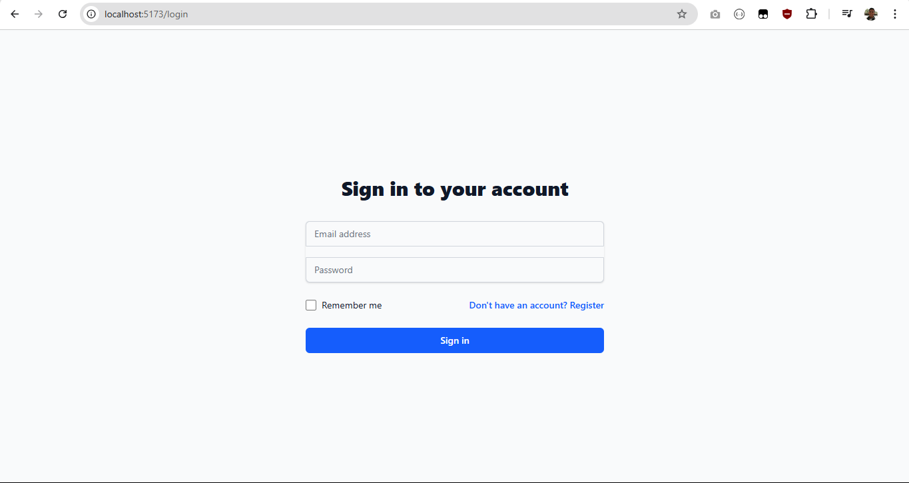
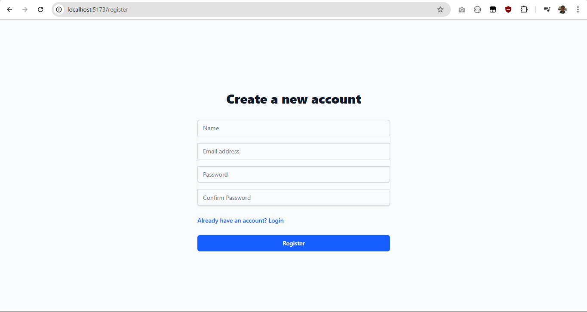
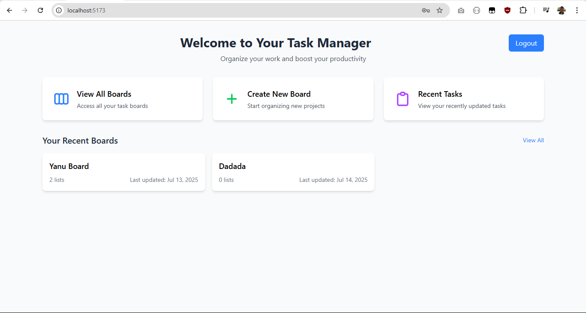
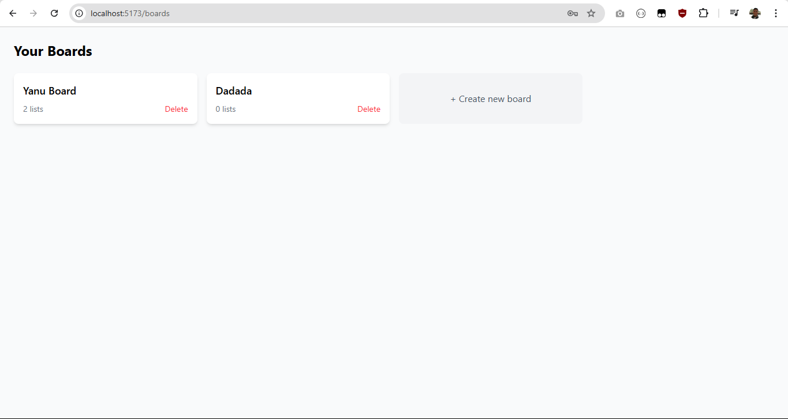

# 🗂️ Task Management Web App

A modern, web-based task management application built with **Laravel 12** (REST API), **Vue 3**, and **PostgreSQL**. Inspired by Trello, this app provides Boards, Task Lists, and Tasks to manage your projects efficiently.

---

## ✨ Features

- 🧩 **Board Management**: Create and manage multiple boards for different projects or teams.
- 📋 **Task Lists**: Organize tasks under lists (columns) within a board.
- ✅ **Tasks**: Create, update, and move tasks between lists.
- 🔐 **Authentication**: Secure login & registration using Laravel Sanctum.
- 📡 **RESTful API**: Built with Laravel 12, fully documented at Postman and ready for integration.
- 📦 **Frontend State Management**: Data handled by Pinia with reactive UI via Vue 3 & Tailwind CSS.

---

## 🛠️ Tech Stack

### 🖥️ Frontend

- [Vue 3](https://vuejs.org/)
- [Vite](https://vitejs.dev/)
- [Tailwind CSS](https://tailwindcss.com/)
- [Axios](https://axios-http.com/)
- [Pinia](https://pinia.vuejs.org/)
- [Vue Router](https://router.vuejs.org/)

### 🧾 Backend

- [Laravel 12](https://laravel.com/)
- [Sanctum](https://laravel.com/docs/sanctum) – Authentication via tokens
- [PostgreSQL](https://www.postgresql.org/) – Database

---

## 📦 Installation
```
git clone https://github.com/yanuadin/tech-test-task-management-app-itpi
```

### 🧑‍🍳 Backend (Laravel API)
```
cd task-management/backend

composer install
cp .env.example .env
php artisan key:generate

php artisan migrate
php artisan serve
```

### 💻 Frontend (Vue 3)
```
cd task-management/frontend

npm install
cp .env.example .env

# Set VITE_API_BASE_URL in .env
npm run dev

```
---

## 🔐 Authentication
Uses Laravel Sanctum to issue secure tokens for API access.
- Login / Register endpoints
- Token-based authentication
- Protected routes via middleware

---
##🧪 Testing
```
php artisan test
# or
npm run test
```
---

## 📸 Screenshots
1. Login Area
   

2. Register
   

3. Home
   

4. Board
   

5. List & Task
   
---
## 📬 Contact
Built with ❤️ by yanuadin
---

Let me know if you'd like it in **Bahasa Indonesia** or if you'd like to auto-generate the API docs section too.
